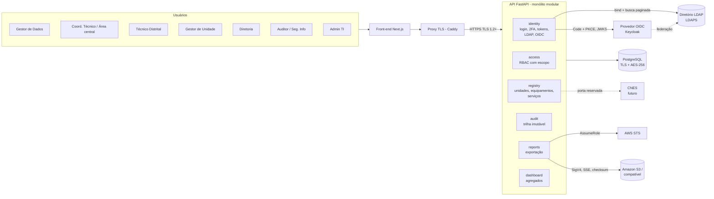
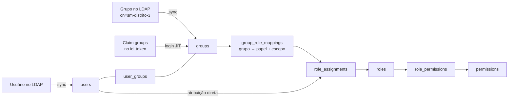
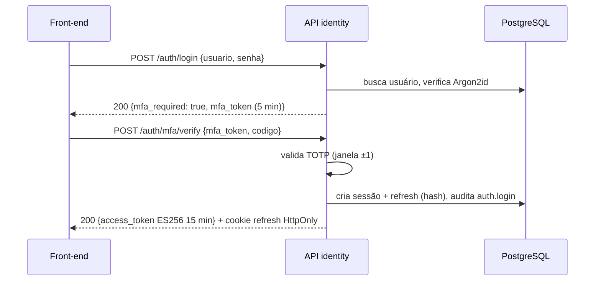
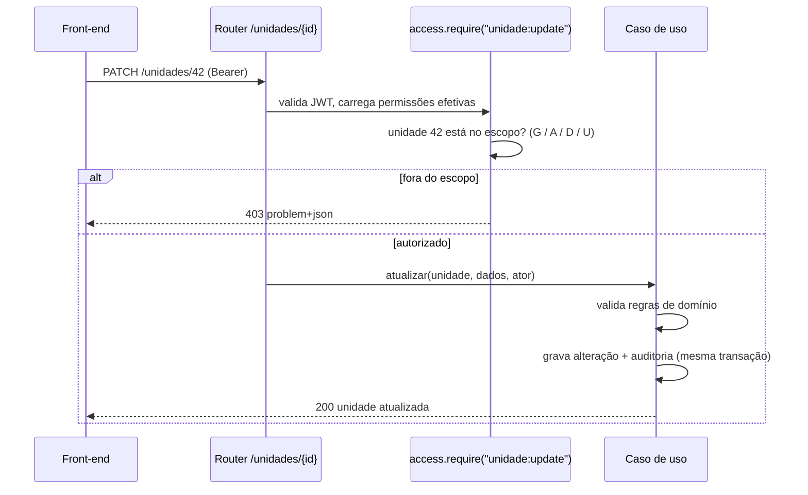
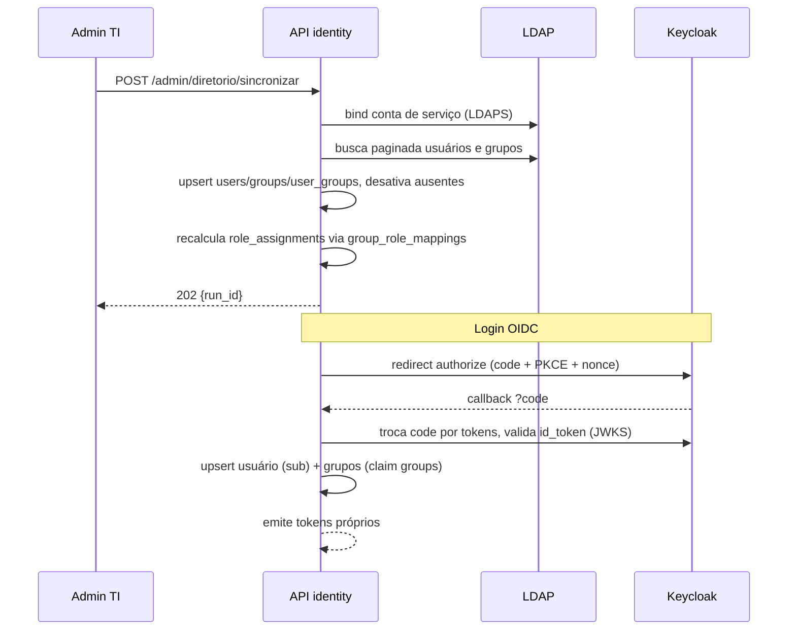
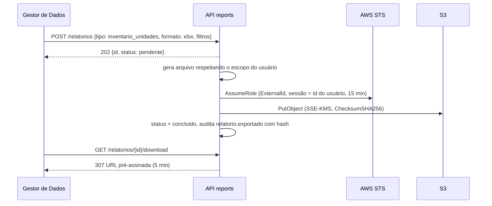

# Arquitetura conceitual da API

> Plataforma de Governança de Dados de Saúde · SESAU Recife · Grupo 01
> Escopo: backend (API FastAPI). Status: proposta inicial, 03/10/2026.

## 1. Visão geral

A API é um **monólito modular**: um único serviço FastAPI, um banco PostgreSQL e módulos com fronteiras explícitas. É a forma mais simples que atende ~250 unidades e uma equipe de seis pessoas, e deixa espaço para extrair um módulo (ex.: relatórios) se um dia for necessário.



## 2. Papéis

Os papéis vêm da matriz RACI, das personas (Atividade 1), do protótipo e da reunião com o cliente (níveis distrital e central). O princípio é **privilégio mínimo com segregação de funções**: quem administra acessos não edita cadastro, e quem audita não altera nada.

| Código | Papel | Origem | Escopo típico | Responsabilidade |
|---|---|---|---|---|
| `ADMIN_TI` | Administrador de TI | RACI: Equipe de TI | global | Gerencia usuários locais, mapeamento grupo→papel, dispara sincronização LDAP. **Não edita cadastro** |
| `GESTOR_DADOS` | Gestor de Dados / Monitoramento central | RACI: Gestor de Dados; reunião: "área de monitoramento central" | global | Responsável pela governança. Edita qualquer unidade, define regras de validação, valida alterações, exporta relatórios |
| `COORD_TECNICO` | Coordenador Técnico / Área técnica central | RACI: Coord. Técnico; reunião: "área técnica central" | área técnica (ex.: Saúde Mental) | Mantém os dados da sua área, valida alterações propostas, exporta relatórios da área |
| `TECNICO_DISTRITAL` | Técnico do Distrito Sanitário | Reunião: "área técnica distrital"; "cada distrito é responsável pelas suas unidades" | distrito | Atualiza unidades do seu distrito; no workflow futuro, propõe e o nível central valida |
| `GESTOR_UNIDADE` | Gestor de Unidade | RACI: Gestor de Unidade; persona 3 | unidade | Atualiza os dados da própria unidade apenas |
| `DIRETORIA` | Diretoria Executiva / Diretor de Informação | RACI: Dir. Exec, Dir. Info; protótipo: Painel executivo | global | Leitura, dashboard e relatórios. Não altera dados |
| `AUDITOR` | Equipe de Segurança da Informação | RACI: Seg. Info | global | Lê trilha de auditoria e eventos de acesso. Não altera dados |

Um usuário pode ter mais de um papel (ex.: um técnico distrital que também é gestor de uma unidade). As permissões efetivas são a união das atribuições, cada uma com seu escopo.

## 3. Recursos

| Recurso | Descrição | Módulo |
|---|---|---|
| `usuario` | Pessoa que acessa a plataforma (local, LDAP ou OIDC) | identity |
| `grupo` | Grupo local ou importado do LDAP/OIDC | identity |
| `sincronizacao` | Execução de sincronização do diretório | identity |
| `papel` / `atribuicao` | Papéis, permissões e atribuições com escopo | access |
| `unidade` | Unidade de saúde (CAPS, CECON, SIM, USF, Policlínica...) | registry |
| `equipamento` | Equipamento de saúde, ligado ou não a uma unidade | registry |
| `servico` | Serviço ofertado, ligado a uma unidade/equipamento ou "solto" | registry |
| `distrito` | Distrito Sanitário (tabela de referência) | registry |
| `alteracao` | Proposta de alteração (workflow futuro, RF-04) | registry |
| `regra_validacao` | Regras de validação configuráveis | registry |
| `auditoria` | Trilha de alterações e acessos | audit |
| `relatorio` | Pedido de relatório e arquivo exportado | reports |
| `dashboard` | Indicadores agregados | dashboard |

## 4. Matriz papel × permissão

`G` = global · `A` = na sua área técnica · `D` = no seu distrito · `U` = na sua unidade · `—` = sem permissão

| Permissão | ADMIN_TI | GESTOR_DADOS | COORD_TECNICO | TECNICO_DISTRITAL | GESTOR_UNIDADE | DIRETORIA | AUDITOR |
|---|---|---|---|---|---|---|---|
| `unidade:read` | — | G | G | G | G | G | G |
| `unidade:create` | — | G | A | — | — | — | — |
| `unidade:update` | — | G | A | D | U | — | — |
| `unidade:deactivate` | — | G | — | — | — | — | — |
| `equipamento:write` / `servico:write` | — | G | A | D | U | — | — |
| `alteracao:propor` *(futuro)* | — | G | A | D | U | — | — |
| `alteracao:validar` *(futuro)* | — | G | A | — | — | — | — |
| `regra_validacao:manage` | — | G | — | — | — | — | — |
| `auditoria:read` | — | G | A | D | U | — | G |
| `auditoria:read_acessos` | G | — | — | — | — | — | G |
| `dashboard:read` | — | G | G | G | G | G | — |
| `relatorio:export` | — | G | A | — | — | G | G (só auditoria) |
| `relatorio:download` | — | G | A | — | — | G | G |
| `usuario:manage` | G | — | — | — | — | — | — |
| `papel:assign` | G | — | — | — | — | — | — |
| `diretorio:sync` | G | — | — | — | — | — | — |

Notas:
- `unidade:read` é global para todos os papéis de negócio porque os dados de unidades são classificados como públicos/internos (Atividade 1, §5.1). Pode ser restringido por escopo sem mudar o código, só os dados de seed.
- A regra do cliente "se o central propõe, *o outro* central valida" vira uma regra de domínio no workflow futuro: quem propõe não pode validar a própria proposta.
- A matriz é carregada por migração de seed e testada: um teste parametrizado verifica cada célula.

## 5. Como identidade, grupos e papéis se conectam



A tabela `group_role_mappings` é o ponto de controle: o Admin TI diz "o grupo `cn=sm-distrito-3,ou=grupos` dá o papel `TECNICO_DISTRITAL` com escopo `distrito = DS III`". Toda sincronização recalcula as atribuições derivadas de grupo; atribuições diretas não são tocadas.

## 6. Organização do código

Cada módulo segue camadas simples (hexagonal "leve"):

```
src/
  main.py                 # cria o app, registra routers, middlewares, lifespan
  core/                   # config, db, segurança, erros, logging (compartilhado)
  modules/
    identity/
      api/                # routers FastAPI e schemas de entrada/saída
      application/        # casos de uso (login, refresh, sync LDAP, callback OIDC)
      domain/             # entidades, regras, portas (interfaces)
      infrastructure/     # repositórios SQLAlchemy, adaptador ldap3, cliente Authlib
    access/
    registry/
    audit/
    reports/
    dashboard/
```

Regras de dependência (verificadas pelo import-linter no CI):
- `domain` não importa FastAPI, SQLAlchemy, boto3 nem ldap3.
- `api` chama `application`; nunca acessa repositório direto.
- Um módulo só usa outro pela sua camada `application` (ex.: `registry` chama `audit.application.registrar`).

## 7. Fluxos principais

### 7.1 Login local com 2FA



### 7.2 Requisição autorizada



### 7.3 Sincronização LDAP e login OIDC



### 7.4 Exportação de relatório para S3



## 8. Superfície inicial da API (v1)

| Método e rota | Permissão | Spec |
|---|---|---|
| `POST /api/v1/auth/login` | pública (rate limit) | 002 |
| `POST /api/v1/auth/mfa/verify` | `mfa_token` | 002 |
| `POST /api/v1/auth/mfa/enroll` · `/confirm` | autenticado | 002 |
| `POST /api/v1/auth/refresh` | cookie + cabeçalho anti-CSRF | 002 |
| `POST /api/v1/auth/logout` | autenticado | 002 |
| `GET /api/v1/auth/oidc/login` · `/callback` | pública | 004 |
| `GET /.well-known/jwks.json` | pública | 002 |
| `GET /api/v1/me` | autenticado | 003 |
| `GET/POST /api/v1/admin/papeis` · `/atribuicoes` · `/mapeamentos-grupo` | `papel:assign` | 003 |
| `GET/POST /api/v1/admin/usuarios` | `usuario:manage` | 003 |
| `POST /api/v1/admin/diretorio/sincronizar` · `GET .../execucoes` | `diretorio:sync` | 004 |
| `GET/POST/PATCH /api/v1/unidades` (+ equipamentos, serviços, referências) | `unidade:*`, `equipamento:write`, `servico:write` | 006 |
| `GET/POST/PATCH /api/v1/validacao/regras` · `/simular` · `/revalidar` | `regra_validacao:manage` | 007 |
| `GET /api/v1/unidades/{id}/historico` · `/auditoria/eventos` · `/auditoria/verificar` | `auditoria:read` | 008 |
| `GET /api/v1/dashboard/resumo` | `dashboard:read` | 009 |
| `POST /api/v1/relatorios` · `GET /{id}` · `GET /{id}/download` | `relatorio:*` | 005 |
| `GET /health/live` · `/health/ready` | pública | 001 |

## 9. Pontos de extensão previstos

- **Workflow de validação (RF-04):** entidade `change_requests` e permissões `alteracao:*` já previstas.
- **CNES (RF-05):** porta `CnesPort` no módulo `registry`.
- **Infraestrutura interna das unidades** (salas, consultórios, status), como o cliente sugeriu: nova entidade filha de unidade, sem mudar as existentes.
- **Worker de relatórios:** troca de `BackgroundTasks` por fila sem alterar a API.
- **Notificações (RF-10):** eventos de domínio já emitidos pela auditoria podem alimentar um módulo futuro.
