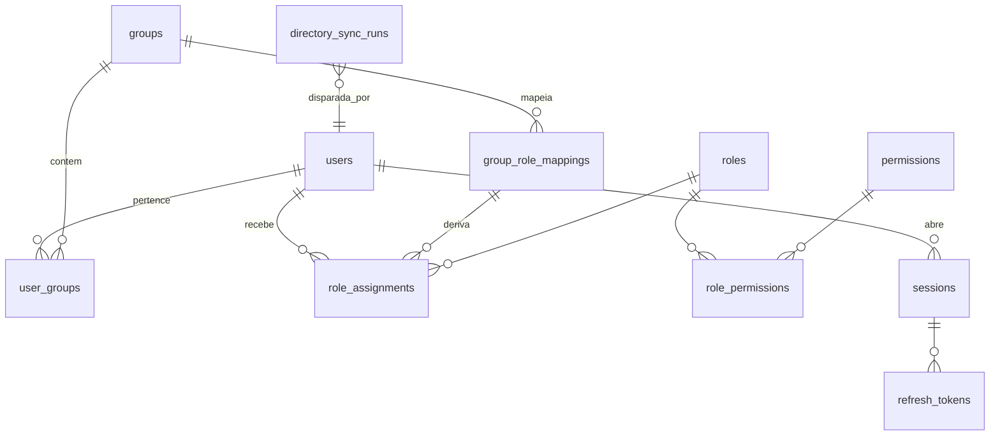
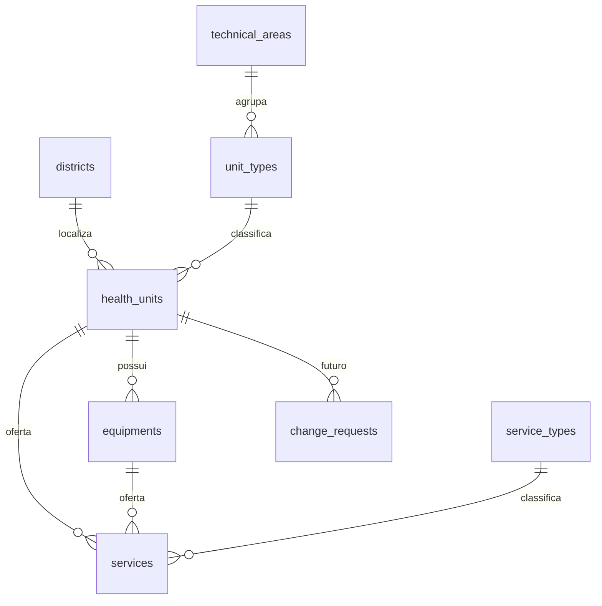

# Modelo de dados (PostgreSQL)

> Proposta inicial. Chaves primárias são `uuid` (v7, ordenável por tempo) salvo tabelas de referência. Toda tabela tem `created_at` e `updated_at` (`timestamptz`, UTC).

## 1. Identidade e acesso

| Tabela | Colunas principais | Observações |
|---|---|---|
| `users` | `id`, `username` (único, minúsculo), `email` (único), `display_name`, `password_hash` (nulo se externo), `source` (`local`/`ldap`/`oidc`), `external_id` (DN ou `sub`), `is_active`, `mfa_enabled`, `mfa_secret_enc`, `failed_logins`, `locked_until`, `last_login_at`, `synced_at` | Único em (`source`, `external_id`). Nunca é apagado, só desativado |
| `groups` | `id`, `name`, `source`, `external_id`, `description`, `is_active`, `synced_at` | Único em (`source`, `external_id`) |
| `user_groups` | `user_id`, `group_id`, `source` | PK composta |
| `roles` | `id`, `code` (ex.: `GESTOR_UNIDADE`), `name`, `description`, `is_system` | Seed por migração |
| `permissions` | `id`, `code` (`recurso:acao`), `description` | Seed por migração |
| `role_permissions` | `role_id`, `permission_id`, `max_scope` (`global`/`area`/`distrito`/`unidade`) | `max_scope` limita o escopo com que o papel pode exercer a permissão |
| `role_assignments` | `id`, `user_id`, `role_id`, `scope_type`, `scope_id` (nulo se global), `origin` (`direct`/`group`), `group_mapping_id`, `granted_by`, `valid_until` | Derivadas de grupo são recalculadas a cada sync |
| `group_role_mappings` | `id`, `group_id`, `role_id`, `scope_type`, `scope_id`, `created_by` | Configuração feita pelo Admin TI |
| `sessions` | `id`, `user_id`, `amr` (`pwd+otp`/`ldap+otp`/`oidc`), `ip`, `user_agent`, `created_at`, `revoked_at` | `sid` no JWT |
| `refresh_tokens` | `id`, `session_id`, `token_hash` (SHA-256), `family_id`, `expires_at`, `used_at`, `revoked_at` | Rotação e detecção de reuso |
| `directory_sync_runs` | `id`, `kind` (`ldap`), `status`, `started_at`, `finished_at`, `triggered_by`, `users_created/updated/deactivated`, `groups_*`, `errors` (JSONB) | Histórico da sincronização |

## 2. Cadastro governado

| Tabela | Colunas principais | Observações |
|---|---|---|
| `districts` | `id` (smallint), `code` (`DS-I`...), `name` | Tabela de referência; lista confirmada com o cliente |
| `technical_areas` | `id`, `code` (`SAUDE_MENTAL`, `SAUDE_BUCAL`, `APS`, `MAC`...), `name` | Escopo do papel `COORD_TECNICO` |
| `unit_types` | `id`, `code` (`CAPS_II`, `CAPS_AD`, `CAPS_IJ`, `CECON`, `SIM`, `USF`, `POLICLINICA`...), `name`, `technical_area_id` | Liga unidade a área técnica |
| `health_units` | `id`, `cnes` (7 dígitos, único quando presente), `name`, `name_normalized` (único), `unit_type_id`, `district_id`, `manager_name`, `cep`, `address`, `neighborhood`, `phone`, `opening_hours` (JSONB), `latitude`, `longitude`, `status` (`ativa`/`inativa`/`em_implantacao`), `pending_issues` (int) | Unicidade por CNES e por nome normalizado (sem acento, minúsculo) evita duplicidade (RF-01) |
| `equipments` | `id`, `unit_id` (nulo para equipamento sem unidade, ex.: UTI móvel), `cnes`, `name`, `equipment_type`, `quantity`, `status` | Atende RF-02 simplificado e o modelo do cliente |
| `service_types` | `id`, `code` (`FARMACIA`, `FARMACIA_FAMILIA`, `SALA_VACINA`, `ESPACO_MAE_CORUJA`...), `name` | Referência |
| `services` | `id`, `service_type_id`, `unit_id` (nulo se "solto"), `equipment_id` (nulo), `name`, `in_cnes` (bool), `status` | Serviço solto, ligado a unidade ou a equipamento, como o cliente descreveu |
| `validation_rules` | `id`, `target` (`health_unit`...), `field`, `rule_type` (`required`/`regex`/`enum`/`range`), `params` (JSONB), `message`, `is_active` | Regras configuráveis pelo Gestor de Dados (complementa as regras fixas em código) |
| `change_requests` *(futuro)* | `id`, `unit_id`, `proposed_by`, `diff` (JSONB), `status`, `reviewed_by`, `reviewed_at`, `comment` | Workflow RF-04; regra "quem propõe não valida" |

Como o vínculo do serviço guarda `unit_id` (e não o nome da unidade), o problema citado pelo cliente do "Espaço Mãe Coruja com nome desatualizado" desaparece: renomear a unidade atualiza todas as visões.

## 3. Auditoria

| Tabela | Colunas | Observações |
|---|---|---|
| `audit_log` | `id` (bigserial), `occurred_at`, `actor_user_id`, `actor_roles` (snapshot), `session_id`, `ip`, `request_id`, `action` (`unidade.update`, `auth.login`, `auth.login_failed`, `relatorio.exportado`...), `entity_type`, `entity_id`, `changes` (JSONB: `[{campo, de, para}]`), `metadata` (JSONB), `prev_hash`, `hash` | Append-only |

- **Imutabilidade:** trigger `BEFORE UPDATE OR DELETE` que lança exceção; o usuário de banco da aplicação só tem `INSERT` e `SELECT` nessa tabela.
- **Encadeamento:** `hash = SHA-256(prev_hash || conteúdo canônico)`. Um endpoint de verificação recalcula a cadeia e aponta adulteração (o protótipo já mostra o hash por evento).
- **Retenção:** 2 anos (RS-05). Partição por mês (`PARTITION BY RANGE (occurred_at)`) facilita expurgo e arquivamento no S3.
- **Dados sensíveis:** `changes` nunca guarda senha, hash ou segredo; campos marcados como sensíveis aparecem como `"***"`.

## 4. Relatórios

| Tabela | Colunas | Observações |
|---|---|---|
| `report_jobs` | `id`, `report_type` (`inventario_unidades`/`trilha_auditoria`), `format` (`csv`/`xlsx`), `filters` (JSONB), `requested_by`, `scope_snapshot` (JSONB), `status` (`pendente`/`gerando`/`concluido`/`falhou`), `storage_bucket`, `storage_key`, `size_bytes`, `sha256`, `error`, `created_at`, `finished_at`, `expires_at` | `scope_snapshot` registra com que escopo o relatório foi gerado |

## 5. Criptografia de campos

| Campo | Técnica |
|---|---|
| `users.password_hash` | Argon2id (hash, não reversível) |
| `users.mfa_secret_enc` | AES-256-GCM, formato `v{versão}:{nonce_b64}:{ct_b64}`, nonce de 96 bits aleatório por gravação, `AAD = user_id` |
| `refresh_tokens.token_hash` | SHA-256 do token opaco (o token em si nunca é gravado) |
| Demais colunas | Criptografia do volume (infra) + TLS no tráfego |
